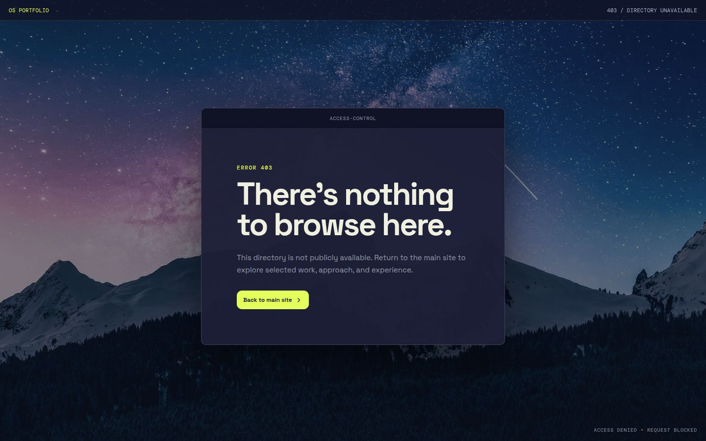
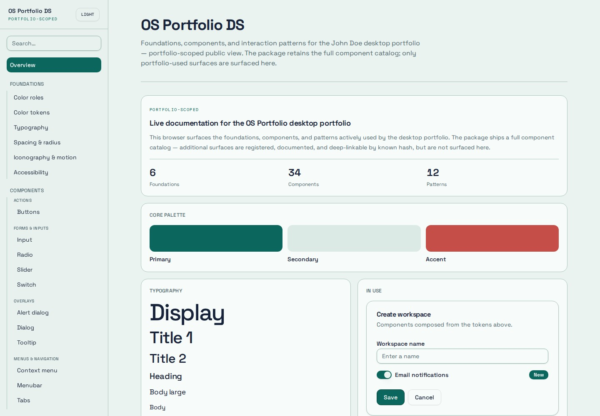

# OS Portfolio

OS Portfolio (OS.Portfolio) is a desktop-inspired portfolio for **John Doe**, built as an interactive operating-system workspace. The repository also contains OS Portfolio DS, the shared design system that defines the portfolio’s visual language, components, accessibility contracts, and interaction patterns.

## Portfolio


The portfolio presents John’s work through draggable and resizable application windows, desktop launchers, a responsive Dock, sticky notes, Terminal, Settings, contextual menus, and persistent workspace preferences. Its responsive geometry preserves the user’s desktop arrangement while adapting windows and navigation for smaller screens.

### Highlights

- Draggable and resizable desktop windows
- Responsive desktop, tablet, and mobile layouts
- About, Work, Terminal, Contact, Settings, and sticky-note applications
- Light and dark themes with independent picture and solid-color wallpaper choices
- Personalized desktop text and theme-specific text colors
- Persistent workspace layout, complete saved defaults, and reset controls
- Accessibility controls for contrast, transparency, animation, and scrollbars
- Keyboard interactions, numbered Dock shortcuts, and semantic ARIA states
- Terminal commands for opening and closing apps, changing themes, and controlling effects

### Protected-directory experience



Apache directory listing is disabled for packaged deployments. Blocked directory requests use a self-contained, dark picture-mode 403 page whose styling and assets remain reliable when Apache preserves the original denied URL.

## OS Portfolio DS



The living OS Portfolio DS documentation site is built with the same tokens and components used by the portfolio. It includes:

- Six foundations covering color, typography, spacing and radius, iconography and motion, accessibility, and effects
- Public documentation for components used by the portfolio
- A consolidated OS Portfolio DS primitives directory
- Thirteen composed interaction patterns
- Interactive examples, specifications, usage guidance, and copyable source
- Registered deep links for internal catalog pages that are not publicly surfaced
- A sidebar with Foundations and Patterns at the top level and every component family nested under Components

## Repository structure

```text
artifacts/
├── os-portfolio/       # Interactive portfolio
├── os-portfolio-ds/   # Shared components, tokens, and living documentation
├── api-server/        # Workspace API service
└── mockup-sandbox/    # Design and component preview workspace
docs/
└── images/            # Repository screenshots
screenshots/           # Validation and feature screenshots
```

This is a pnpm workspace. Shared visual primitives belong to `@workspace/os-portfolio-ds`; portfolio behavior and persistence remain in `@workspace/os-portfolio`.

All resizable OS Portfolio windows with side navigation follow one responsive contract: when the window itself becomes narrow, the sidebar smoothly becomes a horizontal sub-navigation toolbar directly below the window toolbar without changing navigation order, state, or content geometry.

## Development

### Requirements

- Node.js
- pnpm

### Install dependencies

```bash
pnpm install
```

### Run the portfolio

```bash
pnpm --filter @workspace/os-portfolio run dev
```

### Run the design-system documentation

```bash
pnpm --filter @workspace/os-portfolio-ds run dev
```

### Validate the workspace

```bash
pnpm run typecheck
pnpm run build
```

### Run portfolio end-to-end tests

```bash
pnpm --filter @workspace/os-portfolio run test:e2e
```

### Approved GitHub completion checklist

Do not start GitHub completion until the user explicitly says “Approved.” Before the branch is committed and merged, review whether its changes require corresponding updates to this README, Claude instructions or skills, package metadata or exports, and package documentation. Update only the applicable surfaces, validate, refresh this README’s portfolio and design-system screenshots from the running previews, then commit, push the branch, merge it into `main`, push `main`, confirm the main-only release, and delete every local and GitHub branch except `main`.

## Automated website releases

Every push to `main` runs the **Release website ZIP** GitHub Actions workflow. The workflow typechecks and builds the portfolio and design system, validates both archives, and publishes three assets in one standard GitHub release:

- A versioned deployable site ZIP, such as `site-package-0.30.0.zip`, containing the portfolio at the archive root and the design-system site in `os-portfolio-ds/`.
- An unversioned Claude source package named exactly `claude-src-pack.zip`, containing project source, documentation, Claude skills, and the same combined deployment in its top-level `public/` directory.
- `SHA256SUMS.txt`, containing checksums for both ZIP archives.

Feature and maintenance branch pushes never create release packages or prereleases. Only `main` publishes standard releases.

GitHub retains no more than two releases at a time: the newly published release and one previous release. After publishing, the workflow permanently deletes all older releases.

## Design-system development

Design tokens are defined in `artifacts/os-portfolio-ds/tokens.json` and generated before OS Portfolio DS builds and type checks.

```bash
pnpm --filter @workspace/os-portfolio-ds run tokens
```

New shared components and patterns should include:

1. The reusable implementation
2. Canonical specifications
3. Usage and accessibility guidance
4. A component-inventory entry
5. An interactive documentation preview

## License

All portfolio content and project materials are proprietary unless otherwise noted.