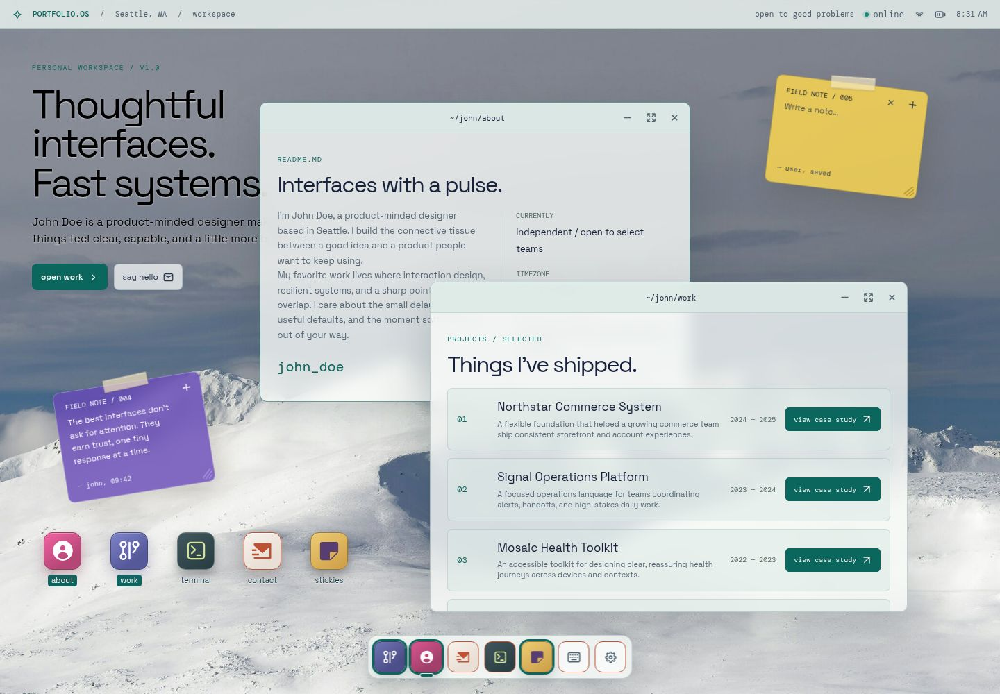
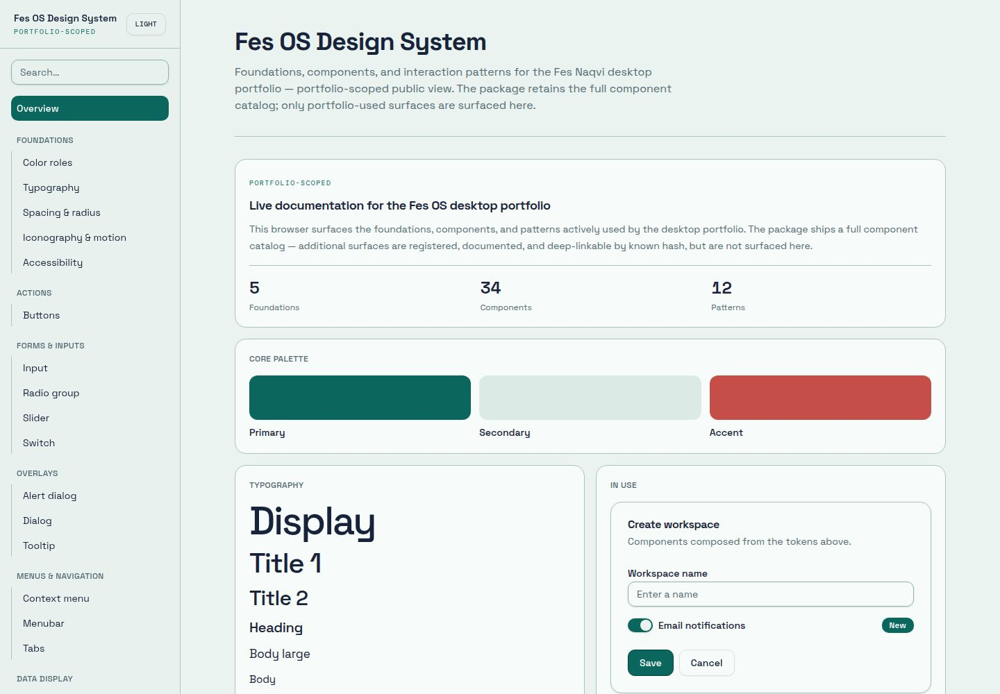

# Portfolio OS Portfolio

A desktop-inspired portfolio for **John Doe**, built as an interactive operating-system workspace. The repository also contains the Portfolio OS design system that defines the portfolio’s visual language, components, accessibility contracts, and interaction patterns.

## Portfolio



The portfolio presents John’s work through draggable and resizable application windows, desktop launchers, a responsive Dock, sticky notes, Terminal, Settings, contextual menus, and persistent workspace preferences.

### Highlights

- Draggable and resizable desktop windows
- Responsive desktop, tablet, and mobile layouts
- About, Work, Terminal, Contact, Settings, and sticky-note applications
- Light and dark themes with independent wallpaper colors
- Persistent workspace layout and saved defaults
- Accessibility controls for contrast, transparency, animation, and scrollbars
- Keyboard interactions and semantic ARIA states

## Portfolio OS Design System



The living documentation site is built with the same tokens and components used by the portfolio. It includes:

- Five visual and accessibility foundations
- Public documentation for components used by the portfolio
- A consolidated Portfolio OS primitives directory
- Twelve composed interaction patterns
- Interactive examples, specifications, usage guidance, and copyable source
- Registered deep links for internal catalog pages that are not publicly surfaced
- A sidebar with Foundations and Patterns at the top level and every component family nested under Components

## Repository structure

```text
artifacts/
├── desktop-portfolio/      # Interactive portfolio
├── portfolio-os-design-system/   # Shared components, tokens, and living documentation
├── api-server/             # Workspace API service
└── mockup-sandbox/         # Design and component preview workspace
docs/
└── images/                 # Repository screenshots
```

This is a pnpm workspace. Shared visual primitives belong to `@workspace/portfolio-os-design-system`; portfolio behavior and persistence remain in `@workspace/desktop-portfolio`.

All resizable Portfolio OS windows with side navigation follow one responsive contract: when the window itself becomes narrow, the sidebar smoothly becomes a horizontal sub-navigation toolbar directly below the window toolbar without changing navigation order, state, or content geometry.

## Development

### Requirements

- Node.js
- pnpm

### Install dependencies

```bash
pnpm install
```

### Run the portfolio

```bash
pnpm --filter @workspace/desktop-portfolio run dev
```

### Run the design-system documentation

```bash
pnpm --filter @workspace/portfolio-os-design-system run dev
```

### Validate the workspace

```bash
pnpm run typecheck
pnpm run build
```

### Run portfolio end-to-end tests

```bash
pnpm --filter @workspace/desktop-portfolio run test:e2e
```

### Approved branch checklist

The exact response **“Approved”** immediately starts the post-approval workflow; it is never treated as simple confirmation. Before the branch is committed and merged, review whether its changes require corresponding updates to this README, Claude instructions or skills, package metadata or exports, and package documentation. Update only the applicable surfaces, then validate, commit, push the branch, merge it into `main`, push `main`, and confirm the main-only release.

## Automated website releases

Every push to `main` runs the **Release website ZIP** GitHub Actions workflow. The workflow typechecks and builds the portfolio and design system, then publishes three assets in one standard GitHub release:

- A versioned deployable site ZIP, such as `site-package-v01.01.zip`, containing the contents of `artifacts/desktop-portfolio/dist/public/` at the archive root.
- A versioned deployable design-system ZIP, such as `design-system-package-v01.01.zip`, containing the contents of `artifacts/portfolio-os-design-system/dist/` at the archive root.
- An unversioned Claude source package named exactly `claude-src-pack.zip`, containing project source, documentation, Claude skills, and a top-level `public/` build.

Feature and maintenance branch pushes never create release packages or prereleases. Only `main` publishes standard releases.

## Design-system development

Design tokens are defined in `artifacts/portfolio-os-design-system/tokens.json` and generated before design-system builds and type checks.

```bash
pnpm --filter @workspace/portfolio-os-design-system run tokens
```

New shared components and patterns should include:

1. The reusable implementation
2. Canonical specifications
3. Usage and accessibility guidance
4. A component-inventory entry
5. An interactive documentation preview

## License

All portfolio content and project materials are proprietary unless otherwise noted.