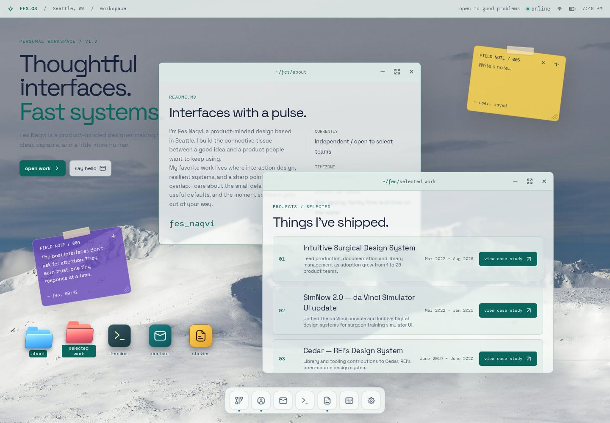

# Fes OS Portfolio

A desktop-inspired portfolio for **Fes Naqvi**, built as an interactive operating-system workspace. The repository also contains the Fes OS design system that defines the portfolio’s visual language, components, accessibility contracts, and interaction patterns.

## Portfolio



The portfolio presents Fes’s work through draggable and resizable application windows, desktop launchers, a responsive Dock, sticky notes, Terminal, Settings, contextual menus, and persistent workspace preferences.

### Highlights

- Draggable and resizable desktop windows
- Responsive desktop, tablet, and mobile layouts
- About, Selected Work, Terminal, Contact, Settings, and sticky-note applications
- Light and dark themes with independent wallpaper colors
- Persistent workspace layout and saved defaults
- Accessibility controls for contrast, transparency, animation, and scrollbars
- Keyboard interactions and semantic ARIA states

## Fes OS Design System


The living documentation site is built with the same tokens and components used by the portfolio. It includes:

- Five visual and accessibility foundations
- Public documentation for components used by the portfolio
- A consolidated Fes OS primitives directory
- Twelve composed interaction patterns
- Interactive examples, specifications, usage guidance, and copyable source
- Registered deep links for internal catalog pages that are not publicly surfaced

## Repository structure

```text
artifacts/
├── desktop-portfolio/      # Interactive portfolio
├── fes-os-design-system/   # Shared components, tokens, and living documentation
├── api-server/             # Workspace API service
└── mockup-sandbox/         # Design and component preview workspace
docs/
└── images/                 # Repository screenshots
```

This is a pnpm workspace. Shared visual primitives belong to `@workspace/fes-os-design-system`; portfolio behavior and persistence remain in `@workspace/desktop-portfolio`.

## Development

### Requirements

- Node.js
- pnpm

### Install dependencies

```bash
pnpm install
```

### Run the portfolio

```bash
pnpm --filter @workspace/desktop-portfolio run dev
```

### Run the design-system documentation

```bash
pnpm --filter @workspace/fes-os-design-system run dev
```

### Validate the workspace

```bash
pnpm run typecheck
pnpm run build
```

### Run portfolio end-to-end tests

```bash
pnpm --filter @workspace/desktop-portfolio run test:e2e
```

## Design-system development

Design tokens are defined in `artifacts/fes-os-design-system/tokens.json` and generated before design-system builds and type checks.

```bash
pnpm --filter @workspace/fes-os-design-system run tokens
```

New shared components and patterns should include:

1. The reusable implementation
2. Canonical specifications
3. Usage and accessibility guidance
4. A component-inventory entry
5. An interactive documentation preview

## License

All portfolio content and project materials are proprietary unless otherwise noted.